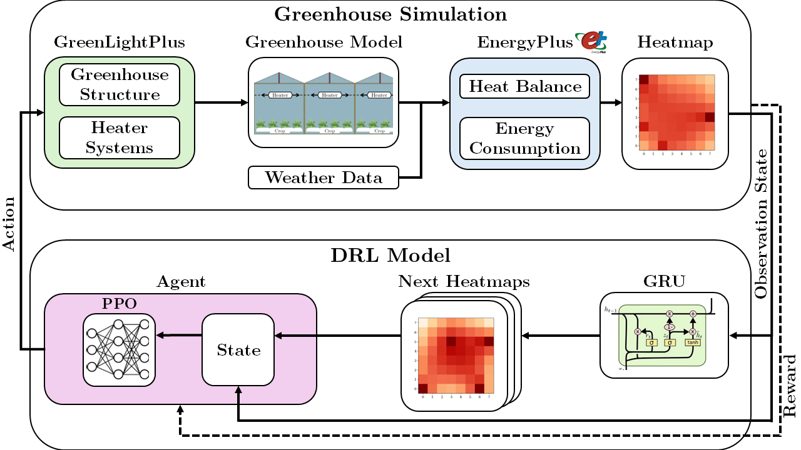

# Deep Reinforcement Learning for Adaptive Control of Heater Position and Heating Power in a Smart Greenhouse
Master's thesis of **Ratta Chindasilpa** at Agricultural Biosystems Engineering, Information Technology Group (INF), Wageningen University and Research, The Netherlands.

**Author:** Ratta Chindasilpa  
**Email:** [raththar@hotmail.com](mailto:raththar@hotmail.com)  
**Supervisor:** Qingzhi Liu

---

## 1. Introduction

Greenhouses play a crucial role in modern agriculture by providing controlled environments that optimize plant growth. However, conventional greenhouse heating systems often rely on **fixed heater placement**, leading to **uneven temperature distributions** and **inefficient energy consumption**. To address these issues, this project introduces an **adaptive heating control system** using **Deep Reinforcement Learning (DRL)** to dynamically adjust heater positions and heating power in response to changing microclimate conditions.

Our approach integrates:
- **Proximal Policy Optimization (PPO) Algorithm** for learning optimal heating strategies.
- **Gated Recurrent Units (GRUs)** for predicting future temperature distributions.
- **EnergyPlus + GreenLightPlus Simulation** for accurately modeling greenhouse microclimates and energy consumption.

The results demonstrate that **adaptive control can reduce temperature deviation by up to 25.51% and energy consumption by up to 34.74% compared to fixed heater deployments**, making it a promising solution for energy-efficient smart greenhouses.

---

## 2. System Design Diagram

### Workflow of the Adaptive Heater Control System



### **Explanation of the Diagram:**
1. **Greenhouse Simulation**: 
   - Simulates the greenhouse environment using **EnergyPlus** and **GreenLightPlus**.
   - Computes indoor temperature distributions and energy consumption.
   
2. **Deep Reinforcement Learning (DRL) Model**:
   - Uses **PPO** to control heater movement and power levels.
   - **GRUs** predict future temperature distributions based on weather data.
   
3. **Control Execution**:
   - The DRL model interacts with the simulation.
   - Heaters are repositioned and adjusted dynamically based on real-time microclimate data.

---

## 3. User Instructions: How to Install and Run the Project

### **File Components**
#### **Required Software**
- **EnergyPlus Simulator**
  - Must be downloaded and placed in `C:\EnergyPlusV24-2-0\energyplus.exe`
  - Version: **EnergyPlusV24-2-0**
- **Python**
  - Version: **3.12.4**
- **Recommended Computer Specifications**
  - **Operating System:** Windows 10/11
  - **RAM:** 16 GB

#### **Datasets**
- `Rotterdam_the_Hague_2023.epw`: EnergyPlus weather data.
- `master_weather_df.csv`: Weather data for training the GRU model.
- `epoch_reward.xlsx`: DRL performance reward data.
- `drl_performance.xlsx`: DRL performance metrics.
- `diff_number_heater.xlsx`: Data for performance comparison across different heater configurations.

#### **Greenhouse Simulation**
- `greenhouse_geometry.py`: Creates the greenhouse structure and heater systems.
- `greenhouse_environment.py`: Runs the greenhouse simulation and DRL model.

#### **DRL Model**
- `gru_model.ipynb`: Trains the **GRU model** for temperature prediction.
- `drl_train.py`: Trains the **PPO model**.
- `drl_test.py`: Tests the **PPO model**.

#### **Experimental Analysis**
- `drl_performance.ipynb`: Analyzes experimental results.

#### **Models**
- `ppo_model.zip`: Trained PPO model (latest version).
- `ppo_model_4heater.zip`: PPO model trained for **4 heaters**.
- `ppo_model_6heater.zip`: PPO model trained for **6 heaters**.
- `ppo_model_8heater.zip`: PPO model trained for **8 heaters**.
- `gru_model.keras`: Trained GRU model for temperature forecasting.
- `greenhouse_geometry_model.idf`: Greenhouse structure for 3D visualization in **OpenStudio**.

#### **EnergyPlus Data**
- `energyplus_data/`: Contains outputs from the EnergyPlus simulator.

### **Step-by-Step Instructions**
1. **Install and Download all files**
2. **Train the DRL Model**
   ```sh
   python drl_train.py
   ```
3. **Test the DRL Model**
   ```sh
   python drl_test.py
   ```
4. **Analyze Experimental Performance**
   - Open `drl_performance.ipynb` in Jupyter Notebook and execute the cells.

---

## 4. Developer Instructions

For developers looking to extend this project:
- Modify `drl_train.py` and `drl_test.py` to fine-tune the PPO model parameters.
- Adjust `greenhouse_environment.py` for different greenhouse configurations.
- Expand `gru_model.ipynb` to improve temperature prediction accuracy.
- Use `greenhouse_geometry_model.idf` in **OpenStudio** for further visualization.

---

## 5. Contributor Expectations

We welcome contributions! Here are some guidelines:
- Fork the repository and create a **feature branch** for your modifications.
- Submit a **pull request (PR)** with a clear description of your changes.
- Ensure your code follows PEP8 coding standards.
- Add documentation for any new features or improvements.

---

## 6. Future Work

While this project has demonstrated promising results, there are several areas for future improvements:
1. **Incorporating Additional Microclimate Factors**
   - Extend simulations to include **relative humidity (RH), CO₂ concentration, vapor pressure deficit (VPD), and light intensity**.
2. **Enhancing Model Performance**
   - Explore alternative reinforcement learning algorithms such as **SAC** or **TD3**.
   - Implement **multi-agent RL (MARL)** to control different greenhouse zones independently.
3. **Expanding the Time Horizon**
   - Train models for **seasonal climate adaptation** over longer time periods.
4. **Implementing a More Granular Control System**
   - Increase the heater's movement resolution.
   - Provide finer heating power adjustments.
5. **Testing on Real-World Greenhouses**
   - Deploy the trained model in real **smart greenhouses** to validate its effectiveness.

---

## 7. Contact
For any questions or issues, please contact:
📧 [raththar@hotmail.com](mailto:raththar@hotmail.com)

---

## ⭐ Star the Repository
If you find this project useful, consider **starring ⭐ this repository** to show your support!
